# Chapter 5: Convolutional Neural Networks

Computer vision is a very exciting and challenging field. While research on computer vision has been happening for decades, deep learning has driven the most recent advances providing order of magnitude improvements since 2012\. In fact, in 2015, deep learning based models surpassed human accuracy at classification tasks. Convolutional Neural Network or CNN is the main model architecture that has driven these improvements. It is widely used in the industry today. From tagging friends in photos to detecting fractures x-ray, there are lots of applications for computer vision. We will continue the EMNIST example from Chapter 1 and see how CNNs can increase accuracy. Specifically, this chapter will:

- Understand key computer vision application areas
- Explain the architecture of Convolutional Neural Networks and build examples
- Use regularization techniques to improve generalization of models
- Detect objects and landmarks in images
- // Include page numbers for ease of reference

# Technical Requirements

This chapter uses Python, TensorFlow 2.0, Jupyter Notebooks for building and training the models. Data files from training are reused from Chapter 1 Github location. All the code for this chapter is in

<github-repo>/Chapter5.</github-repo>

For the mobile application pieces, an iOS-based mobile app will be built. It will be developed using XCode running on MacOS 10.13.6 or above. The models developed will be converted for mobile use as demonstrated in previous chapters, using TensorFlow Lite. Further, MLKit, part of Firebase, will be used to put the trained model into the app. // list technologies and installations required here.

// Provide Github URL for the code in the chapter (setup instructions should be on the Github page). Create a Github folder named, "chX", where X is the chapter number. For example, ch1

# H1: Computer Vision Application Areas

Before building deep learning networks for computer vision tasks, it would useful to get an overview of key problems in this area. Main areas of interest in computer vision, amongst others, are:

- Image classification
- Object detection
- Landmark detection or keypoint detection
- Image labelling and captioning
- Super Resolution and Compression

## H2 Image Classification

Interest in application of deep learning in computer vision started with massive gains evidenced in the ImageNet Large Scale Visual Recognition Challenge (ILSVRC). Figure 5-1 below shows the improvements with the arrival of deep learning in 2012 with the landmark AlexNet paper. 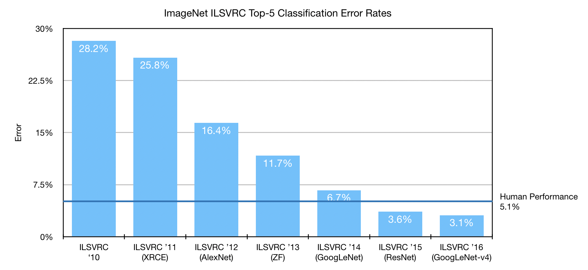 Note the huge drop of about 10% between 2011 and 2012 results. This was the advent of deep learning techniques to image recognition. Prior to this, there were very small movements in accuracy. In 2015, CNNs surpassed human level accuracy of 5.1%.

> Info Box: Top-5 Classification Error rate: this measures whether the actual label for a given image was one of the top 5 labels predicted by the model.

In fact, this particular challenge has been retired since 2017 given that human level performance has been surpassed and replaced with object detection described below.

EMNIST is an image classification task. We will build a better image classification model using CNNs in this chapter.

## H2 Object Detection

This is a very important aspect of computer vision, being in focus due to interest and advances in self-driving or autonomous vehicles. Objective here is to identify key objects in an image. I t can be applied to videos as well, by parsing a frame at a time. An example is shown in Fig 5-2 below.

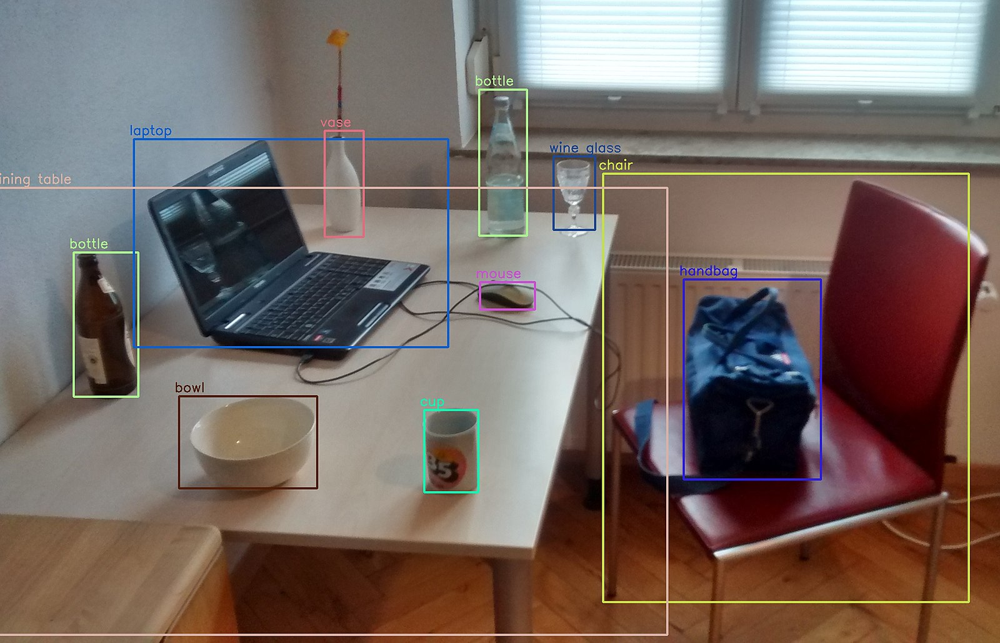

ImageNet mentioned above has moved to this as the key benchmark for reporting progress now. This is a complex task as objects may be partially occluded and of different sizes and orientations. Further, for use in autonomous vehicles, the models used must be very fast. This would allow multiple frames of the video to be processed every second leading to higher reliability and safety of the vehicle.

We will build an object detection network later in this chapter to detect character bounding boxes in an image and hook it up to the EMNIST detection model to recognize them.

## H2: Landmark Detection or Keypoint Detection

A key point or a landmark marks an important part or feature of an image. If the image is of a face, then these can be different facial features like eyebrows, eyes, nose, lips etc. Fig 5-3 shows an example from Google's MLKit. Later in this chapter, we will try to build an app that takes selfies based on how wide a person is smiling. _TODO: See if it is feasible_

 (Image source: <https://firebase.google.com/docs/ml-kit/detect-faces>, CC 3.0 permissive license)

TODO: <https://webrtchacks.com/ml-kit-smile-detection/>

In other applications, human poses can also be marked. This is a key development used in motion capture techniques that are used in movies and animations. most notable movie that used this live motion capture technique is Avatar directed by James Cameron. Similar techniques were used by Microsoft Kinect to understand human poses to control video games.


## H2: Image Captioning and Labeling

This is a very exciting development in the world of deep learning. It combines two areas, namely computer vision and natural language process (NLP). The task is to generate human readable labels given an image. It can be used to convert images into textual features and answer arbitrary questions about objects in the image. It can be used as an assistive technology for visually impaired persons. Applications are endless. This is a very complex field that is an active area of research.  Source: <https://ai.googleblog.com/2016/09/show-and-tell-image-captioning-open.html>

Chapter 7 of this book is devoted to this application area and will cover it in detail.

## H2: Super Resolution and Compression

Objective of these types of computer vision tasks are to either compress the image to a small size and then reconstruct the high resolution image on the different device, or to take an image and increase it's resolution and level of detail at the same time. There are additional use cases in converting an image with low detail, possibly shot during low light or night scene and add detail to it. In Chapter 8, we will unsupervised networks like Generative Adversarial Network (GAN) and Auto-encoders to perform this task. Image compression is especially useful in mobile settings as it can save bandwidth for communication while not comprising on quality.

Now that you have a good overview of the exciting application areas in computer vision, lets start working on the first of these - image classification. We will start with understanding Convolutional Neural Networks (CNN) architecture, and build a new classifier for EMNIST using this architecture.

## Convolutional Neural Networks for Classification

CNNs were inspired by the work of neurophysiologists David Hubel and Torsten Weisel, who eventually won a Nobel Prize. Their work put forth theories on how the _primary visual cortex_ functions in the mammalian brain. Signals that stimulate the retina result in simple pre-processing and then these signals are transferred to the primary visual cortex at the back of the head. These signals, as they move through layers of the brain and processed, follow the following structure:

- A sense of a 2-dimensional or spatial map is preserved about the image
- Simpler cells do simple detections like edges, curves, and colors. These cells work on small localized areas of the spatial map
- Complex cells aggregate inputs from the simpler cells to detect higher level concepts like faces. These cells have some resistance to the position of an object (like a face, or a car) in an image. As complex cells aggregate or _pool_ inputs, they can also become immune to changes in contrast or lighting.

CNNs emulate these key properties of the visual cortex in the following ways:

- Hierarchical representation: Recall from Chapter 1 that use of multiple layers in a deep learning network results in a hierarchical representation of features. This emulates the behaviour of layers of simple and complex cells. Complex cells, or units in the later layers of the network take inputs of neighbouring units for aggregation or _pooling_.
- Convolutions for locality sensitivity or sparse interactions: In a spatial map of the image, consider a random pixel. Chances are the pixels left, right, up, down and diagonally around that pixel are highly correlated to that pixel. This property of _locality sensitivity_ is very important. Conversely, it implies that connections of all units in a layer are not connected to every unit in the successive layer. This results in _sparse interactions_. Recall that in our first EMNIST model, all the pixels were fed in to the network with no notion of similarity between adjacent or close pixels. Structure of image data allows such locality sensitivity to be exploited through _convolutions_. Convolutions are described in more detail in the next section.
- Translation Invariance: This is a key property which allows the object to be detected to be located in different places in the image and yet be classified. Fig 5-6 shows an example of translation invariance to illustrate the concept. This property allows labels to be associated with entire images, instead of identifying the exact location of the object in the image. While this simplifies collection of data sets and training, it is crucial for the widespread success of CNNs. It enables the actual test images to differ from the training images in terms of the position of the object and still be able to detect it.

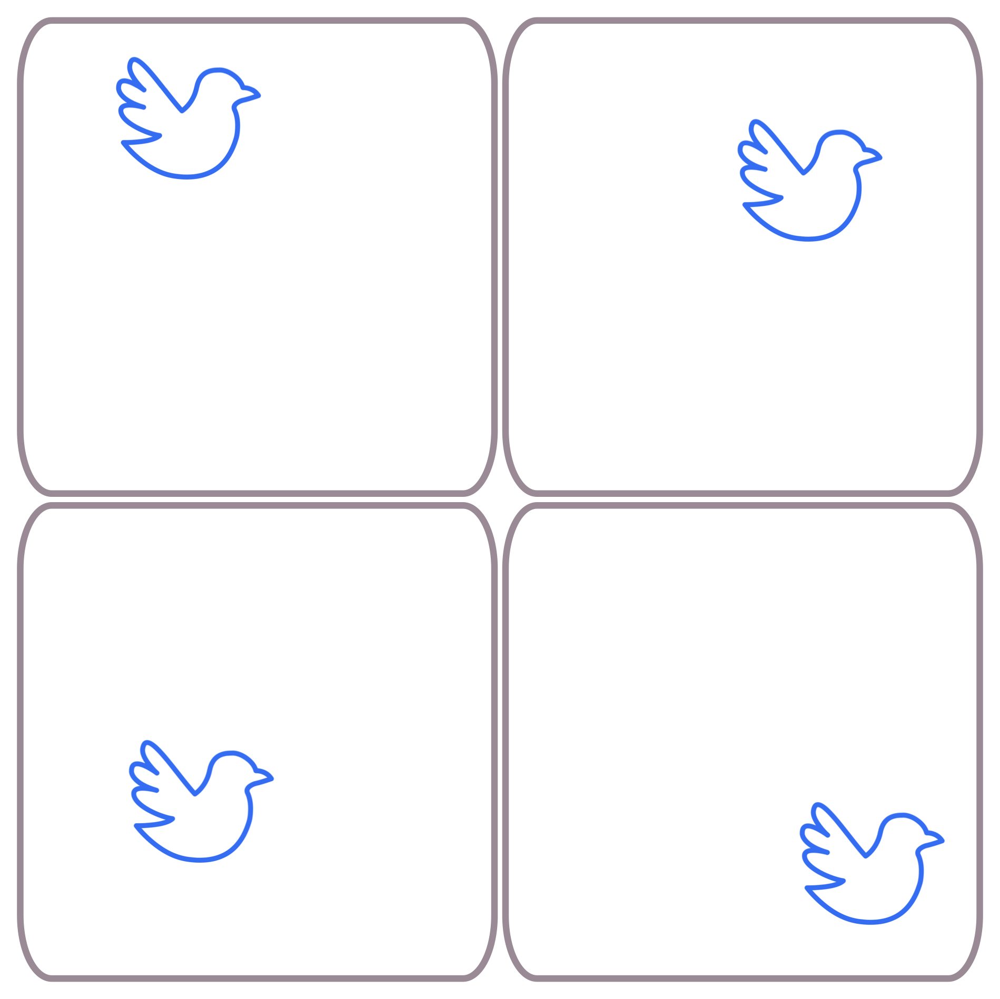

While we have been using 2 dimensional images as the main use case, these concepts generally apply to one dimensional data, such as an audio signal or a time series equally. It is important to see if a given problem has translation invariance and locality sensitivity properties. If it does, then CNNs would be a great fit for that problem.

Next two sections describe the concepts of convolutions and pooling in detail. These two are the core concepts of CNN architectures.

### Filters and Convolutions

In traditional computer vision prior to the advent of deep learning, filters were used to detect features like edges. These filters were hand crafted by scientists and engineers. Output of these features was used to feed into successive machine learning algorithms to aid in detection. Usually, these filters are 3x3 or 5x5 matrices that are _convolved_ with the image to produce a resultant image. The convolution example shall be illustrated with code. As an example, consider the Sobel Filter. This filter can be used to detect horizontal and vertical edges.

$$ G_{vertical} = \begin{bmatrix} -1 & 0 & +1 \ -2 & 0 & +2 \ -1 & 0 & +1 \end{bmatrix} * X $$

$$ G_{horizontal} = \begin{bmatrix} -1 & -2 & -1 \ 0 & 0 & 0 \ +1 & +2 & +1 \end{bmatrix} * X $$

- represents the convolution operation. $G_{vertical}$ represents a vertical edge detection filter while $G_{horizontal}$ can be used to detect horizontal edges. These filters are also called _kernels_, _masks_ or _convolution matrix_. _X_ contains the pixels of the input image represented as a 2D matrix. Fig 5-7 below shows the calculation on an example for one cell of the output matrix. The convolutional matrix or the kernel is moved over the input left to right and top to bottom as indicated by the arrows.


To see how this works, open up `convolution_arithmetic.ipynb` and run the following pieces of code. To see the impact of the Sobel filter defined above, we will use an image from the author's collection.

> Info box: This code example requires installation of Pillow image management library in Python. Installation in `conda` environment can be done through `$ conda install Pillow` . `scipy.signal` provides a `convolve2d` function which is used to implement this example. Example file used can be found in `githubrepo/Chapter5/images/chap5-tulip.jpg`.

```
# Load the image from the directory
tulip = Image.open("images/chap5-tulip.jpg")

#convert to gray scale image
tulip_grey = tulip.convert('L')
tulip_ar = np.array(tulip_grey)

# show the image
plt.imshow(tulip_grey)
```

These lines load the image, convert into grayscale and put it into a Numpy array. Next, the two filters shown above are defined.

```
kernel_1 = np.array([[-1, 0, 1],
                   [-1, 0, 1],
                   [-1, 0, 1]])   # Vertical edge detection kernel / filter
kernel_2 = np.array([[-1, -1, -1],
                   [0, 0, 0],
                   [1, 1, 1]])   # Horizontal edge detection kernel / filter
```

Now, to compute the result and visualize it, run the following piece of code.

```
from scipy.signal import convolve2d
out1 = convolve2d(tulip_ar, kernel_1)  # vertical filter output
out2 = convolve2d(tulip_ar, kernel_2)  # horizontal filter output
```

This will produce an output as shown in Fig 5-8.

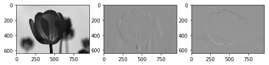

Figure 5-8: Result of Sobel filter for detecting edges using convolutions

One of the challenges in computer vision earlier was hand-constructing these filters. In CNNs, these filter parameters are learnt automatically. Secondly, multiple filters are stacked on top of each other to create multiple outputs for the same input pixels. The idea here is to learn different types of representations in terms of simple and complex units through these stacked filters. Just like weights were learned in a fully connected network, the values for these filters are learned in CNN architectures.

There are some key hyper parameters used in convolutional layers that need to be chosen:

- _Filter depth_: This is the number of filters that are evaluated at a particular layer. For example, if the horizontal and vertical filters above are stacked together, then this would give a depth of 2.
- _Kernel size_: In the Sobel filter above, the kernel size was 3x3\. However, different kernel sizes like 5x5, 7x7 or 11x11 can also be used.
- _Stride size_: In the previous example, the filter was moved one pixel at time to the right and down. These values can be changed. Having larger stride size reduces computational and memory requirements and may help bring further apart features together in higher layers.
- _Padding_: It seems that kernel strides are limited by the bounds of the image. However, it is possible to pad the edges of the image to allow different stride sizes and resulting image sizes. There are two common settings for paddings:

  - Same: This padding ensures that the result has the same number of values as the input. This is shown in Fig 5-9.
  - Valid: This is same as saying no padding. In this case, the result of the computation has fewer values than input, as shown in Fig 5-10.

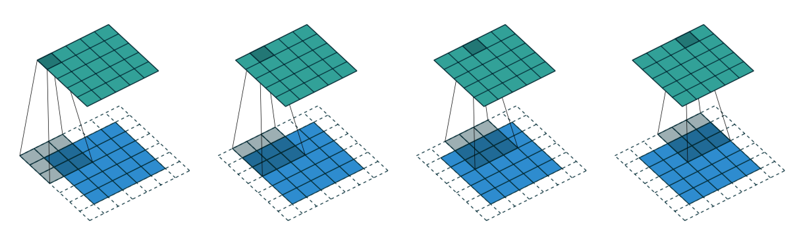 Figure 5-9: Stride size 1 and same padding for convolution (Source: <https://github.com/vdumoulin/conv_arithmetic>) 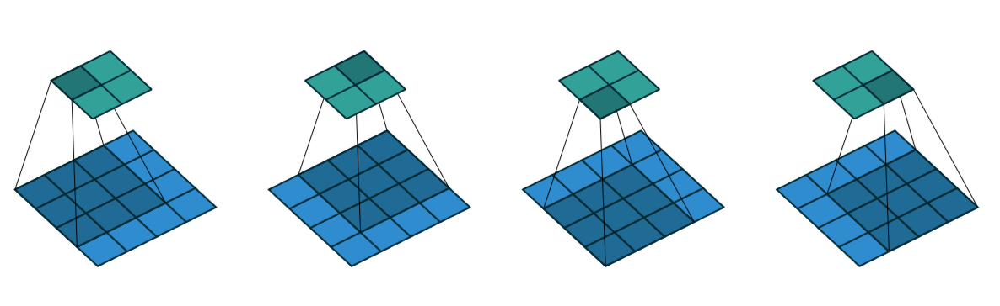 Figure 5-10: Stride size 1 and valid padding for convolution (Source: <https://github.com/vdumoulin/conv_arithmetic>)

> Infobox: _A guide to convolutional arithmetic for deep learning_ paper provides in depth coverage of impact and meaning of these hyper parameters. It also provides formulae It can be found on <https://arxiv.org/pdf/1603.07285.pdf>

_Receptive field_ of a unit after convolution operation denotes the inputs that have influenced the value of that unit. By stacking multiple layers, each unit can have a wide effective receptive field, which allows CNNs to learn relationships. This idea is demonstrated in Fig 5-11\. One unit in the top most orange layer is composed of inputs from a very large area in the bottom most layer. This allows the composition of simple and complex cells as explained earlier.

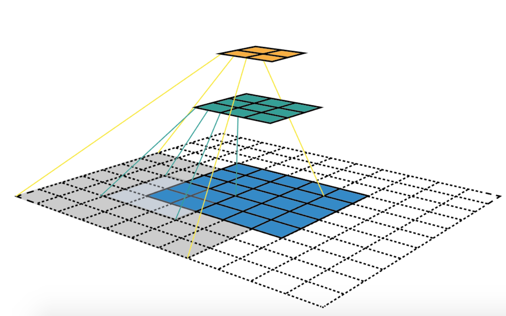 Figure 5-11: Receptive fields (NOTE: Please redraw this image)

After the outputs of the convolution operation are calculated, a nonlinear activation is applied. These activation functions, like ReLU, sigmoid, tanh etc, are same as the ones discussed in Chapter 1\. In the Sobel filter example above, no such function was used. It is common to have a third stage after a few convolutional layers called pooling. This is the focus of the next section.

### Pooling

Consider the top green outputs of the convolution step depicted in Fig 5-10\. A non-linear activation function will be applied to each of the four cells. A pooling layer would summarize neighboring outputs. It can be considered a way of down-sampling. Obvious benefits of this include reduction in the size of data flowing through the network leading to faster training and reduced memory usage, it further strengthens small translation invariance.

Pooling has a kernel size parameter. This parameter specifies a matrix size on which to apply the pooling operation. There are different options for implementing pooling. The most common option is called _max pooling_ and is shown in Fig 5-12\. Pooling kernel is of size (2,2) in this example. Max pooling operation picks the maximum value in the cells the kernel is operating on, and makes that the output value. another common pooling operation is _average pooling_, where the cells are averaged and this average becomes the output value. Max pooling is the most commonly used choice.

 Figure 5-12: Max Pooling (Image source: <https://commons.wikimedia.org/wiki/File:Max_pooling.png>)

A pooling kernel size of (2, 2) will halve the size of the input. Different kernel sizes can be chosen for the pooling operation. Similar to the convolution operation above, a stride size and padding option can be specified for the pooling operation. By default, the stride size is selected to be same as size of the kernel. This can be seen in Fig 5-12, where the pooling kernel is (2, 2) and is moving 2 steps right and down to produce the output. These default values are fairly common to start training the first CNN.

Now that we know the basics building blocks of CNNs, let's build an CNN to recognize EMNIST.

## EMNIST with CNNs

Code for this example can be found in `<TODO:git path>/Chapter5/mobile_cnn_model.ipynb`. A set of utilities to simplify loading and visualizing EMNIST data are available in `<TODO:git path>/utils/emnist_utils.py` file.

> Warning / Tip CNNs will cause a significant increase in number of trainable parameter and training time. To speed up training, consider using a GPU machine. You can build your own or use a cloud provided version.

After loading and normalizing the data, we will define the convolution and pooling layers. TensorFlow and Keras both have extensive support for CNNs.

```
# (1) First the input layer
inputs = keras.Input(shape=(28,28,), name='emnist_inp')
x = layers.Reshape((28, 28, 1))(inputs)  # since images are gray scale, they have only one channel

# (2) Learn 64 different filters, each 3x3 in size, with valid pooling, and (1,1) stride size
x = layers.Conv2D(64, (3, 3), activation='relu')(x)

# (3) Pooling layer
x = layers.MaxPooling2D(pool_size=(2, 2))(x)

# (4) Dimensions after pooling are 13x13x64\. The 28x28 image is now 13x13 with 64 filters
x = layers.Flatten()(x)

# (5) Traditional dense/FC layers to use these inputs for classification
# This part is similar to previous model
x = layers.Dense(256, activation='relu', name='dense_1')(x)
x = layers.Dense(128, activation='relu', name='dense_2')(x)
outputs = layers.Dense(47, activation='softmax', name='predictions')(x)

cnn = keras.Model(inputs=inputs, outputs=outputs, name='cnn_model_1')
cnn.summary()
```

Given the amount of complex theory that goes into CNNs, Keras and TensorFlow do a wonderful job of hiding this complexity and allowing ML engineers to focus on building the network. Lets analyze the code above. (1) sets up the input layer and shows that each image is 28x28\. Then, it is reshaped to 28x28x1 tensor. This is because it is a gray scale image. the added dimension just denotes the 'gray' channel. If this was a color image like RGB, then this could be reformatted into 28x28x3 to denote the three channels. Note that the number of channels is last in this data format. this is called `channels_last` or NHWC. Here, 'N' refers to number of data samples, 'H' refers to height of each image, 'W' is width of the image and 'C' refers to the channels. It is also possible to have data in NCHW format. `layers.reshape` method can be used to convert between these formats.

> Infobox: It is common mistake to not be careful with the data format sizes and get errors. Another tip: NCHW format is more efficient on NVIDIA GPUs while NHWC is more efficient for CPUs. More tips on performance can be found on <https://www.tensorflow.org/guide/performance/overview>

In (2) and (3), a convolutional layer is added with 64 filters followed by a max pooling layer are added. The kernel is of size 3x3\. By default, _valid_ padding is used if a padding is not supplied. Since _stride size_ is also not provided, it is assumed as (1,1), which means 1 pixel in the right and down directions. `tf.keras.layers.Conv2D` takes many other options and you are encouraged to look into the API and play with some of these.

T0 prepare these for input into the dense classification layers, (4) flattens this _volume_ of 13x13x64 into a single layer of 10,816 units. These dimensions can be verified by the summary shown below. (5) shows the two dense layers followed by an output layer. Note that this is identical to the fully connected network designed in Chapter 1\. One key point of difference is that that network took 28x28 or 784 values as inputs. Through stages of CNN, these have become over ten thousand inputs.

```
Model: "cnn_model_1"
_________________________________________________________________
Layer (type)                 Output Shape              Param #   
=================================================================
emnist_inp (InputLayer)      [(None, 28, 28)]          0         
_________________________________________________________________
reshape (Reshape)            (None, 28, 28, 1)         0         
_________________________________________________________________
conv2d (Conv2D)              (None, 26, 26, 64)        640       
_________________________________________________________________
max_pooling2d (MaxPooling2D) (None, 13, 13, 64)        0         
_________________________________________________________________
flatten (Flatten)            (None, 10816)             0         
_________________________________________________________________
dense_1 (Dense)              (None, 256)               2769152   
_________________________________________________________________
dense_2 (Dense)              (None, 128)               32896     
_________________________________________________________________
predictions (Dense)          (None, 47)                6063      
=================================================================
Total params: 2,808,751
Trainable params: 2,808,751
Non-trainable params: 0
_________________________________________________________________
```

Note that the summary above has a lot more parameters than the previous model. This is around 2.8 million trainable parameters compared to approximately 240 thousand parameters in the previous model.

> Tip: Training the model on the CPU is certainly possible, but slower than training on a GPU. This example was trained on a GPU. Your running times will be different based on CPU or GPU used for training. Also note that the accuracy of the model may be slightly different as well between GPU and CPU. This is due to differences in how rounding is handled for double and float data types. So don't be concerned if your accuracies do not exactly match with the examples.

Lets train the model as shown below.

```
# Lets compile the model and TRAIN it
cnn.compile(optimizer=tf.keras.optimizers.Adam(0.001),
              loss='categorical_crossentropy',
              metrics=['accuracy'])
history = cnn.fit(norm_train_features, one_hot_train_labels, epochs=10, batch_size=128)

Epoch 1/10
697932/697932 [==============================] - 33s 48us/sample - loss: 0.4692 - accuracy: 0.8421
Epoch 2/10
697932/697932 [==============================] - 30s 43us/sample - loss: 0.3198 - accuracy: 0.8846
....
Epoc 10/10
697932/697932 [==============================] - 30s 43us/sample - loss: 0.2048 - accuracy: 0.9177

# Evaluate the model on the TEST set
cnn.evaluate(norm_test_features, one_hot_test_labels, 47)

116323/116323 [==============================] - 5s 47us/sample - loss: 0.3395 - accuracy: 0.8888
```

Note that the difference in accuracy between training and testing has increased compared to the example in Chapter 1\. Here training accuracy is 91,77% while accuracy on the test set is 88.88%. In the fully connect network example, training accuracy was 85.14% and test set accuracy was 84.15%. Recall from Chapter 1 that this ability of a model to perform on an unseen data set, in this case the test set, is a measure of it's generalizability. When a model is deployed into production, distribution of data it will receive compared to the dsitribution of data it was trained on is not always the same. Hence, a model that generalizes better will perform better in production even though it may have lower training accuracy. There are a set of techniques, also known as _regularization_, that are covered in a later section in this chapter. For now, it is important to get a visual sense of hoe signal is being transmitted through various parts of the network.

To understand and monitor our network as it trains, TensorFlow comes with a tool called _TensorBoard_. This is a really useful tool to understand and debug deep learning networks. This is the focus of the next section prior to discussing regularization.

### Visualizing Training with _TensorBoard_

Deep learning applications are very hard to debug during training. In large data sets, training could be running for days potentially. To debug and understand how a network is being train, TensorBoard is shipped with TensorFlow. It is a web based debug tool that can visualize how training is going in near real time. Once it is configured properly, it can generate graphs like Fig 5-13 and number of other diagnostic information.

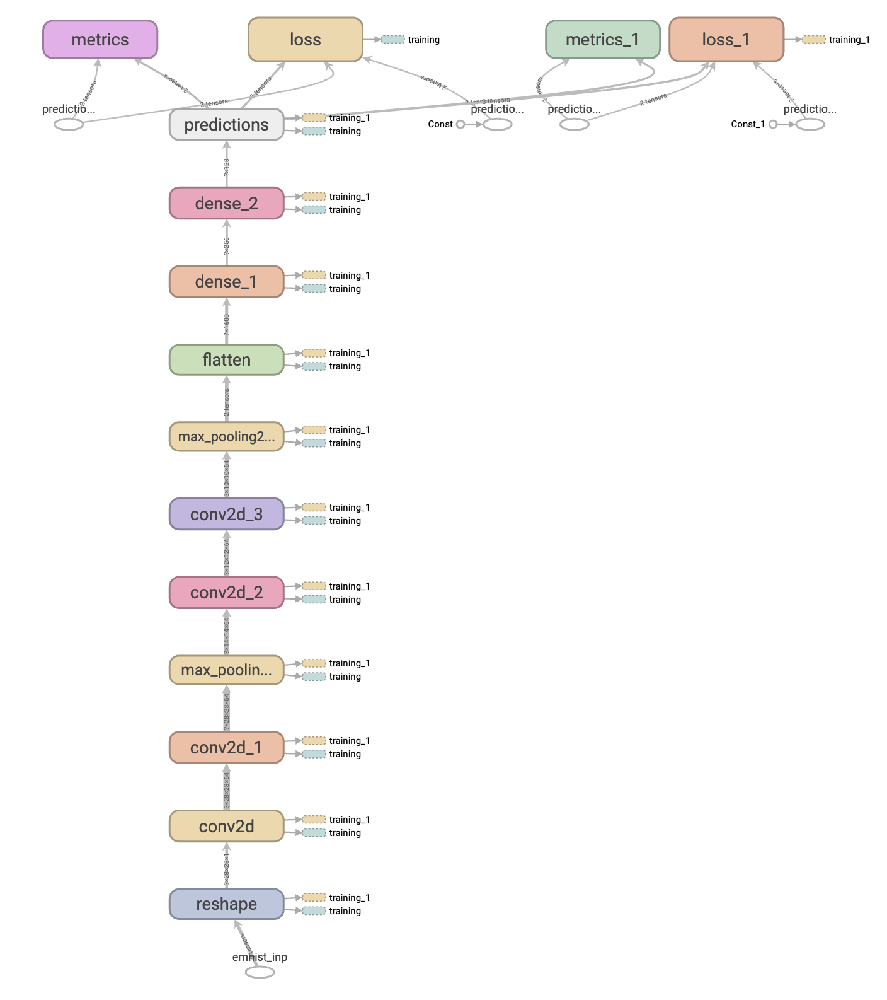

Figure 5-13: CNN Graph Structure generated by TensorBoard

Getting TensorBoard to work is relatively straightforward. Specific commands need to be added to the training loop that log information of interest during training. These pieces of information are stored to a directory location that TensorBoard can access. TensorBoard reads data from this location and keep refreshing the visualizations. Lets configure this for our example. In `mobile_cnn_model.ipynb` file, skip to the heading _New Deeper Network_ to see the full code. For this example, we are going to use a more complex CNN model with:

- 2 convolutional layers with same padding followed by a max pooling layers

```

  # (1) First the input layer

  inputs = keras.Input(shape=(28,28,), name='emnist_inp') x = layers.Reshape((28, 28, 1))(inputs) # since images are gray scale, they have only one channel

# (2.1) Learn 128 different filters, each 3x3 in size, with valid pooling, and (1,1) stride size

x = layers.Conv2D(128, (3, 3), activation='relu', padding="same")(x) x = layers.Conv2D(128, (3, 3), activation='relu', padding="same")(x) # 2 convolutional layers

# (3.1) Pooling layer

x = layers.MaxPooling2D(pool_size=(2, 2))(x)
```

- 2 more convolutional layers with valid padding followed by a max pooling layer

```

# (2.2) Learn 64 different filters, each 3x3 in size, with valid pooling, and (1,1) stride size

x = layers.Conv2D(64, (3, 3), activation='relu')(x) x = layers.Conv2D(64, (3, 3), activation='relu')(x) # 2 convolutional layers

# (3.2) Pooling layer

x = layers.MaxPooling2D(pool_size=(2, 2))(x)
```

- 2 dense layers

```

# (4) Dimensions after pooling are 5x5x64\. The 28x28 image is now 5x5 with 64 filters

x = layers.Flatten()(x)

# (5) Traditional dense/FC layers to use these inputs for classification

# This part is similar to previous model

x = layers.Dense(256, activation='relu', name='dense_1')(x) x = layers.Dense(128, activation='relu', name='dense_2')(x)
```

- Softmax output layer

```

outputs = layers.Dense(47, activation='softmax', name='predictions')(x)

cnn2 = keras.Model(inputs=inputs, outputs=outputs, name='cnn_model_2') cnn2.summary()
```

> Infobox: Note that the total number of trainable parameters for this deeper network are 708,399\. This is much smaller than the number of trainable parameters in the first CNN built above. However, this network takes longer to train and is more accurate. Recall that CNNs are building feature hierarchies. Having deeper networks build higher level structures which are easier to classify. Secondly, use of convolution and pooling keeps a check on the number of trainable parameters. However, it takes longer to train as gradient propagation increases with addition of layers adding to training time.

Configuring TensorBoard is easy. First step is to create a log directory folder. This folder will have subfolders that have statistics from various training runs. Add these lines after the network is setup. Note that these can be added anywhere in your Python code.

```

import os, datetime

# sets the log directory as a subdirectory of the folder this python notebook is store in

logs_base_dir = "./logs"

# If the directory does not exist, create it

os.makedirs(logs_base_dir, exist_ok=True)

# (1) Make a subdirectory with date and time formatted string to keep track of runs

logdir = os.path.join(logs_base_dir, datetime.datetime.now().strftime("%Y%m%d-%H%M%S"))

# (2) Register a callback with Keras to call after every epoch is completed

tensorboard_callback = keras.callbacks.TensorBoard(logdir, histogram_freq=1, write_images=True)
```

(1) setups a subdirectory under the log directory to store outputs from a training run. Note that the name of this subdirectory is dynamically generated based on the date and time.

> TIP: It is important to use unique names for training runs, otherwise data can be overwritten and inconsistent results will be seen in TensorBoard.

Any scheme for generating this name can be used. (2) configures the setup of the TensorBoard logging as a callback from Keras. This method takes a number of arguments such as:

- `log_dir`: the path of the directory where to save the log files to be parsed by TensorBoard.
- `histogram_freq`: frequency (in epochs) at which to compute activation and weight histograms for the layers of the model. If set to 0, histograms won't be computed. Validation data (or split) must be specified for histogram visualizations.
- `write_graph`: whether to visualize the graph in TensorBoard. The log file can become quite large when write_graph is set to True.
- `write_images`: whether to write model weights to visualize as image in TensorBoard.
- `update_freq`: 'batch' or 'epoch' or integer. When using 'batch', writes the losses and metrics to TensorBoard after each batch. The same applies for 'epoch'. If using an integer, let's say 1000, the callback will write the metrics and losses to TensorBoard every 1000 samples. Note that writing too frequently to TensorBoard can slow down your training.
- `profile_batch`: Profile the batch to sample compute characteristics. By default, it will profile the second batch. Set profile_batch=0 to disable profiling. Must run in TensorFlow eager mode.

To start training and logging data, a small modification is needed in the `fit` method shown below. Now, start training.

```

# Lets compile the model and train it

cnn2.compile(optimizer=tf.keras.optimizers.Adam(0.001), loss='categorical_crossentropy', metrics=['accuracy'])

# Note the addition of the validation data and callback in the training loop

history = cnn2.fit(norm_train_features, one_hot_train_labels, epochs=10, batch_size=128, validation_data=(norm_test_features, one_hot_test_labels), callbacks=[tensorboard_callback])
```

To see the visualizations, following command can be used from the command line:

```

$ tensorboard --logdir

<path_to_log_dir>
</path_to_log_dir>
```

This will be default start the TensorBoard web application on port 6006\. Replace the path to the log directory based on what was configured in the code above. Open a web browser and navigate to `localhost:6006` of the appropriate server name and port TensorBoard was started on to visualize the output. this will bring up the default web page as shoown in Fig 5-14.

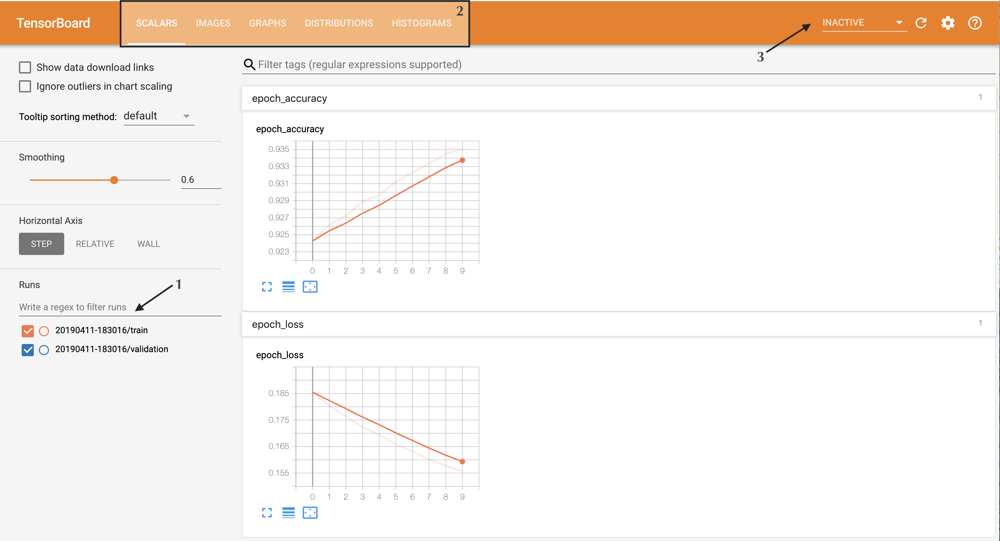

Figure 5-14: TensorBoard

There are three main part of this interface. Looking at the labels in Fig 5-14:

1\. Training runs: this section shows the training runs. Recall that in the code above, we chose the directory names based on date and time. These show up here as training runs. there are pairs because we passed in training and testing set of data to validate training against. 2\. Top navigation shows the features of TensorBoard that have data or are activated. In this case, you should see Scalars, Images, Graphs, Distributions, and Histograms. Default tab should be Scalars.

- Scalars: It will show how accuracy and loss has varied over epochs for training and test sets. As training is running, these will be dynamically updated. Fig 5-15 shows the output from a training run after 3 epochs. 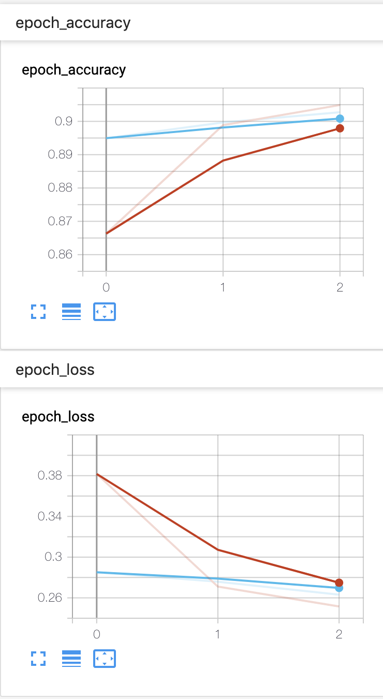
- Images: This section allows images to be logged from the network.
- Graphs: This visualizes the graph of the network that has been created. This was used to generate Fig 5-14.
- Distributions and Histograms show how the weights and biases are changing over the course of training. It is useful in debugging if the network is learning as per expectations. An example is show in Fig 5-16\. 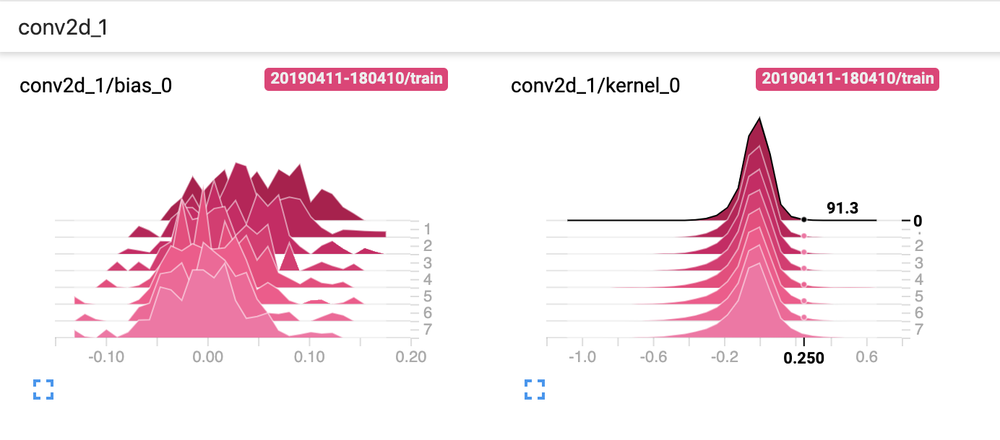

3\. _Inactive_ shows the other visualizations that can be generated by TensorBoard but that aren't currently active. There is a refresh button next to it to update the visualizations. By default, TensorBoard updates every thirty seconds. This behavior can be changed by clicking the gear icon.

To see how TensorBoard can be useful in debugging outputs, consider the plot in Figure 5-17.

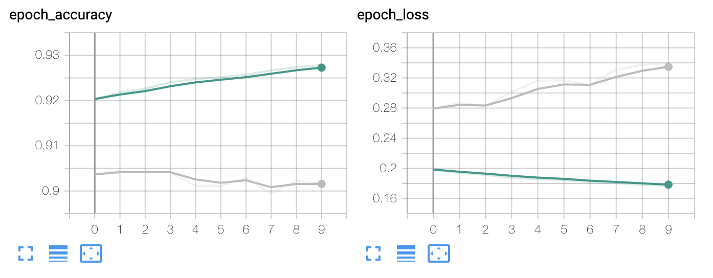

Figure 5-17: Debugging accuracy and loss using TensorBoard scalars plots

In this plot, the green line represents the training set and the grey line represents the test set. Focussing on the loss plot on the left, it seems that while training error is reducing, test error is increasing! This is generally a sign of the network overfitting or memorizing the data set. The next section talks about how to generalize better so that this gap between the training and test sets can be minimized.

> InfoBox: Activation atlas is a unique way of visualizing CNNs. It maps activations at each pixel to images that were used to train the network providing a in-depth explainable analysis of how the network is working. while description of this paper is beyond the scope of this book, you are encourage to take a look at <https://distill.pub/2019/activation-atlas/>. It is written in a very accessible and approachable way.

## Generalization through Regularization

When the network has high capacity, it can start to memorize the training data. This makes it less effective at classifying unseen data. This is possibly the reason for the differences shown in the previous section. _Generalization_ is the ability of the network to accurately classify unseen data. This ability to generalize is what makes machine and deep learning different from optimization. Optimization is closed form and operates on a known data set. It optimizes or maximizes a desired outcome given a data set. It makes no guarantees on performance of the solution on unseen data sets. However, it is key that deep learning solution generalize, otherwise it would be of severely limited applicability. _Regularization_ is the process by which the solution obtained through optimization can be generalized.

Process of optimization, through gradient descent and weight update, is learning the weights and biases for different units of the network. These weights are multiplied by the inputs to calculate activations. It is possible that some of the features or inputs in the training set are highly predictive. Consequently, the model will learn larger weights for them. The network will spend effort extracting signal from other weights as it would have found a solution. However, these features may be not be as predictive in the test set. The test set should ideally be drawn from the same distribution as the training set, however this assumption is not strictly true in production use cases. Now, the trained model tries to classify the test set and will not have much success as it would put too much emphasis on some features through larger weights and consequently larger activations values. Regularization in its simplest form, is a way to constrain the weights so that they cant become too large for any input. This will force the network to discover and learn from other inputs. Typically, applying regularization reduces training accuracy, but increases test accuracy. A common technique is _L2 Regularization_, which can be applied to any network, including dense networks.

Process of optimization, through gradient descent and weight update, is learning the weights and biases for different units of the network. These weights are multiplied by the inputs to calculate activations. It is possible that some of the features or inputs in the training set are highly predictive. Consequently, the model will learn larger weights for them. The network will spend effort extracting signal from other weights as it would have found a solution. However, these features may be not be as predictive in the test set. The test set should ideally be drawn from the same distribution as the training set, however this assumption is not strictly true in production use cases. Now, the trained model tries to classsify the test set and will not have much success as it would put too much emphasis on some features through larger weights and consequently larger activations values. Regularization in its simplest form, is a way to constrain the weights so that they cant become too large for any input. This will force the network to discover and learn from other inputs. Typically, applying regularization reduces training accuracy, but increases test accuracy. Common techniques used are _L2 Regularization_, _L1 Regularization_, and _Dropout_. _Batch Normalization_, technically being a optimization technique, is sometimes regarded as a regularization technique. Lastly, data augmentation is also used to increase the size of the dataset to help with generalization. These techniques are covered in subsequent sections.

### L2 and L1 Regularization

This technique is very general, and is applicable in logistic regression, linear regression as well as deep learning networks. It is known by many names like _ridge regression_, and _Tikhonov regularization_. Objective of L1 and L2 regularizations is to constrain the weights in the model by adding a penalty in the loss function that depends on the square of the magnitude of the weights. Recall definition of loss functions from Chapter 1\. The sum of the squares of all the weights, that the inputs are multiplied with, is multiplied by a regularization constant and added to the loss as the regularization penalty. This regularization constant or parameter is often denoted by $\lambda$. Consequently the loss formula becomes:

$$ loss_{regularized} = loss + \lambda * \sum_i w_i^2 $$

The net effect of adding this term is that the optimizer is now trying to actively reduce the overall loss. If a specific solution is chosen by the optimizer that causes weights to increase or decrease to large values, the advantage of reduction in the loss term will be offset by the increase of this regularization term. In other words, the model is constrained to not rely one a few inputs too much. This leads to better generalization on unseen test data.

L1 regularization, also sometimes referred to as _lasso regression_, adds the sum of the absolute values of the weights instead of the square. Loss equation looks like so:

$$ loss_{regularized} = loss + \lambda * \sum_i \vert w_i \vert $$

> Info box: Lasso stands for Least Absolute Shrinkage and Selection Operator

L1 regularization works differently than L2 regularization. It can have the effect of reducing some of the weights to zero. This will result in those input or features to be ignored in the model. This, it can act as a feature selection tool.

$\lambda$, or the regularization parameter, is another hyper parameter that now needs to be selected and tuned. It's value can vary quite a bit. If a large value is chosen, it will reduce the model's capacity and may lead to underfitting. If a very small value is chosen, it may not have adequate impact on the weights being learned and may not address generalization.

`tf.keras.regularizers` package provides implementations of these two in TensorFlow. They can be added to a dense or convolutional layer through the use of optional `kernel_regularizer` parameter. Here is an example of applying L2 regularization with $ \lambda $ of 0.001, to the first dense layer. Selection of this hyper parameter can be difficult task. Using the data from TensorBoard about histograms of the weights and the losses, a reasonable starting estimate can be made about this parameter and tuned from there. Modify the dense layer code from the deeper network above like so:

```
# ... rest of NN definition above

# (5) Traditional dense/FC layers to use these inputs for classification
# This part is similar to previous model
x = layers.Dense(256, activation='relu',
                 kernel_regularizer=keras.regularizers.l2(l=0.001),
                 name='dense_1')(x)
x = layers.Dense(128, activation='relu',
                 kernel_regularizer=keras.regularizers.l2(l=0.001),
                 name='dense_2')(x)
outputs = layers.Dense(47, activation='softmax', name='predictions')(x)

# ... code continues
```

The effect of this can be seem after running the training and testing on the deeper model with and without generalization. Training accuracy reduced from 92.34% to 90.57% while test error reduced from 90.22% to 90.01%. It is clear that now the test and training are working more in sync with each other.

Typically, L1 and L2 regularizers are applied to dense layers. Next section discusses a key advancement in CNNs, called dropout.

### Drop Out

Dropout is a technique where a given percentage of connections between layers are randomly dropped between each mini-batch run. This is applied to non-output layers. It can be applied on the input layer, though this is more common in vision applications. Most importantly, this approach is only used during training. During inference, all the connections are restored.

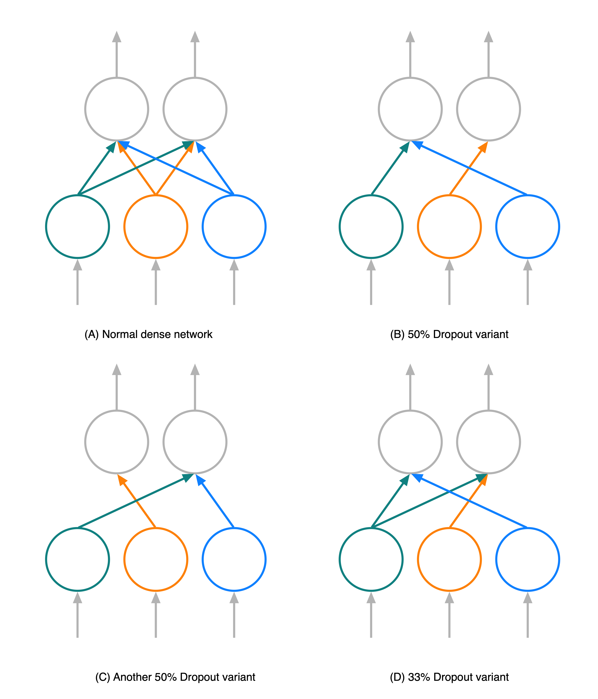

Figure 5-18: Dropout Examples

Fig 5-18 above shows some examples of dropout. (A) shows a two-layer network. Grey lines denote input or output units. connections are color coded showing connections from each unit to the next layer. Assuming a dropout ratio of 50%, which means that half of the connections from a preceding layer are randomly dropped, (B) demonstrates one such configuration of the network while training. For some other mini-batch, the network may look like (C). In a way, this is similar to _ensemble_ methods, where output of multiple networks is averaged to produce the output. Intuition behind drop out is that dropping connections forces units to do more work on learning relationships, and not depend on all inputs to it being present. note that this would reduce the activation that the next layer receives by the amount of drop out. It is common to boost the output by the dropout percentage to compensate for this loss. Thankfully, TensorFlow takes care of these complexities.

Typically, a dropout layer is added after the convolutional and max pooling layer of a convolutional section of the network. Dropout is added between each dense layer. In Tensorflow, `keras.layers.Dropout` can be added to the network definition. Let's define a network assuming a drop out percentage of 20%, without any L2 regularization.

```
# (1) First the input layer
inputs = keras.Input(shape=(28,28,), name='emnist_inp')
x = layers.Reshape((28, 28, 1))(inputs)  # since images are gray scale, they have only one channel

# (2.1) Learn 128 different filters, each 3x3 in size, with valid pooling, and (1,1) stride size
x = layers.Conv2D(128, (3, 3), activation='relu', padding="same")(x)
x = layers.Conv2D(128, (3, 3), activation='relu', padding="same")(x)  # 2 convolutional layers
# (3.1) Pooling layer
x = layers.MaxPooling2D(pool_size=(2, 2))(x)
# (4.1) Dropout Layer, dropping 20% of the connection
x = layers.Dropout(0.2)(x)

# (2.2) Learn 64 different filters, each 3x3 in size, with valid pooling, and (1,1) stride size
x = layers.Conv2D(64, (3, 3), activation='relu')(x)
x = layers.Conv2D(64, (3, 3), activation='relu')(x)  # 2 convolutional layers
# (3.2) Pooling layer
x = layers.MaxPooling2D(pool_size=(2, 2))(x)
# (4.2) Dropout Layer, dropping 20% of the connection
x = layers.Dropout(0.2)(x)
```

The dense layers are as they were before addition of L2 regularization above.

All the places dropout has been added are marked with a _4.x_ number. Drop out is added after the two convolutional blocks (4.1 and 4.2).

> Tip: Dropout should only be used during training and not during inference or when the model is deployed. Keras makes it easy to set this up without changing model definition or code. Depending on the method being used, it sets a flag to use or ignore dropout. When the `evaluate` function is used, dropout is ignored. Dropout layers takes a boolean argument `training`, which can be set to true if training is being done.

Training the network after using dropout results in :

```
Train on 697932 samples, validate on 5000 samples
Epoch 1/10
697932/697932 [==============================] - 117s 168us/sample - loss: 0.2538 - accuracy: 0.9043 - val_loss: 0.2470 - val_accuracy: 0.9094
...
Epoch 10/10
697932/697932 [==============================] - 117s 168us/sample - loss: 0.2189 - accuracy: 0.9131 - val_loss: 0.2500 - val_accuracy: 0.9082

# Evaluate the model on the test set
cnn2_dropout.evaluate(norm_test_features, one_hot_test_labels, 47)

116323/116323 [==============================] - 10s 88us/sample - loss: 0.2588 - accuracy: 0.9069
```

Dropout has the amazing affect of increasing overall accuracy! Testing accuracy was 90.22% without regularization. With dropout, this has moved to 90.69%!

> TIP: Plan to train your network for more epochs when using dropout. It helps the network learn the right relationships even as dropout reduces signal going from one layer to the other.

## Batch Normalization

Batch normalization aims to reduce variance of the outputs coming from one layer being fed into the next layer. By reducing this variance, it acts like L2 regularization which attempts the same thing by adding penalties on the weights to the cost or loss. Main motivation is to efficiently back-propagate gradient updates through as large number of layers while minimizing the risk that this update could result in divergence. In stochastic gradient descent, gradients calculated are used to update weights of all layers at the same time, assuming that output of one layer doesn't impact other layers. However, this is not a completely valid assumption. For a n-layer network, doing this properly would need nth order gradients which is intractable. Instead, batch-norm is used that works on a mini batch at a time and constrains of the updates to reduce this unwanted shift in distribution of weights by normalizing the outputs before they are fed into the next layer.

Basic algorithm of batch-norm involves taking the outputs or activations from a layer, calculating their mean an standard deviation and rescaling by these. Recall data normalization and scaling as described in Chapter 1\. The main differences are:

- It is being done between layers. In chapter 1, it was done once for the input data only
- It is done at a mini-batch level as opposed to the entire data set at a time

There are two learnable parameter $\gamma$ and $\beta$ that are multiplied with the normalized data before sending to the next layer. Let's demystify how this layer works. This math is shown in the equations below. Assume that $x$ represents the set of values over a mini-batch that are input to batchnorm.

$\mu_B = {1\over m }\sum_i x_i$ where there are m samples in the minibatch.

$\sigma^2_B = {1\over m}\sum_i(x_i - \mu_B)^2$ calculates the standard deviation of the minibatch

$\hat x_i = {{x_i - \mu_B} \over {\sqrt{\sigma_B^2 + \epsilon}} }$ scales the individual values. Note use of a very small value $\epsilon$ to prevent divide by zero errors. Finally,

$output_i = \gamma\hat x_i + \beta$ provides the output of the batchnorm layer. Note that if $\gamma$ is set to the standard deviation and $\beta$ is set to the mean, then the original input will be recreated. This is the main benefit of these learning parameters. They allow the network to decide how much scaling is effective.

Implementing this is quite easy in Tensorflow as batchnorm is available as a layer, very similar to dropout. To view the full code, scroll to the _Batch Normalization_ section of the notebook. Batchnorm along with dropout will be put between each convolution layer as shown in the code below. This pattern is repeated. Full code is not shown here for brevity.

```
# (1) First the input layer
inputs = keras.Input(shape=(28,28,), name='emnist_inp')
x = layers.Reshape((28, 28, 1))(inputs)  # since images are gray scale, they have only one channel

# (2.1) Learn 128 different filters, each 3x3 in size, with valid pooling, and (1,1) stride size
x = layers.Conv2D(128, (3, 3), activation='relu', padding="same")(x)
# (5.1) BatchNormalization added between conv layer
x = layers.BatchNormalization()(x)
# (4.1) Dropout Layer, dropping 20% of the connection
x = layers.Dropout(0.2)(x)
```

Quick summary of the network shows an increase in the trainable and non-trainable parameters of the network. Full summary will show how many parameters were added by batchnorm.

```
=================================================================
Total params: 709,935
Trainable params: 709,167
Non-trainable params: 768
```

> INFO: Non-trainable parameters those that are selected by the developer and are not learned through training. An example of non-trainable parameter is dropout amount.

As mentioned above, this network is trained for 15 epochs, which is more than the previous versions. Note that training on a CPU can take a long time, even hours potentially.

> TIP: If you intend to work in Deep Learning, a good NVIDIA GPU may be a great investment. It will help speed up any rendering and animation work for your mobile apps, as well as significantly improve training times. As a bonus, all the games on your machine will work much better. A good GPU would cost between US$400-600\. Comparatively, this is roughly the amount that was estimated the author would spend on Google Cloud. However, note that complex networks which need distributed GPUs would require use of a cloud provider.

Lets compile the model and start training.

```
# Lets compile the model and train it
cnn2_do_bn.compile(optimizer=tf.keras.optimizers.Adam(),
              loss='categorical_crossentropy',
              metrics=['accuracy'])

# take a small part of the test set as a validation set
val_test_features = norm_test_features[:5000]  # there are 116K test samples
val_test_labels = one_hot_test_labels[:5000]

# Note the addition of the validation data and callback in the training loop
history = cnn2_do_bn.fit(norm_train_features, one_hot_train_labels,
                   epochs=15, batch_size=128,
                   validation_data=(val_test_features, val_test_labels)
                          )

Train on 697932 samples, validate on 5000 samples
Epoch 1/15
697932/697932 [==============================] - 194s 278us/sample - loss: 0.1959 - accuracy: 0.9210 - val_loss: 0.2584 - val_accuracy: 0.9072
...
697932/697932 [==============================] - 193s 277us/sample - loss: 0.1801 - accuracy: 0.9260 - val_loss: 0.2677 - val_accuracy: 0.9076
```

TensorBoard logging and callbacks have been removed for this particular example to speed up training. As a exercise, consider adding that code back-in to test your familiarity. Testing it against the test data set, it returns an accuracy of 90.74%. This is better than 90.69% after just adding dropout.

> TIP: If you have been following along and running these training examples, it may seem that a lot of work is being done for a very small improvements or gains. This is the hard reality of working in Deep Learning. It becomes harder and harder to squeeze performance out of the networks.

## Data augmentation

Refer to imbalance in images. See if we can create more samples by changing contrast for the few characters that are low on samples. use <https://www.tensorflow.org/versions/r2.0/api_docs/python/tf/keras/preprocessing/image/ImageDataGenerator>

## Mobile Optimization Part I

Show how to save and convert to mobile format. talk about building object detection to read lines of text from camera.

## Object Detection / Landmark using CNN? (check what yolo uses)

Check from this article: <https://blog.netcetera.com/face-recognition-using-one-shot-learning-a7cf2b91e96c> see if we can isolate characters from a line of text.

### Detecting characters from a line of text from mobile Camera

# Optional Content (Time Permitting)

## Visualizing Convolutions

- visualizing output of each convolutional layer

### Smile Detection Selfie Taking App

## Questions

1. What are the two key properties of a CNN that make them so effective at computer vision tasks?

2. You may have noticed that the number of trainable parameters have changed significantly when using a CNN. You may wonder if adding more dense layers which lead to same number of trainable parameters would lead to similar accuracy. This is a good exercise to try. Try two architectures:

  - Deeper: Add more layers rather than units in the layers
  - Wider: Add more units in the layers than adding more layers and see what you learn about how these networks perform. How do these perform on accuracy and training time?

3. Compare the confusion matrix from the Jupyter notebook for the first CNN model with Fig 15 from Chapter 1\. Do you see any differences? Checkout the confusion between B-8 and O-0\. Would you expect these two to behave differently? Why or why not?

4. 20% of the units/connections were randomly dropped out. What is the effect of using different drop out values like 50%?
