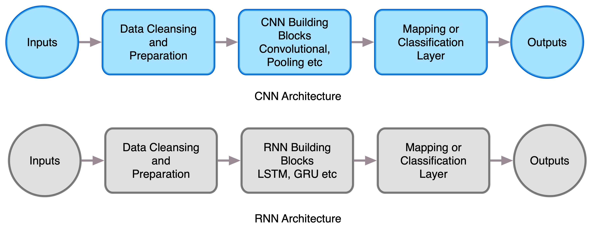

Speech recognition and language processing capabilities have become mainstream with the popularity of digital assistants like Siri and Alexa and various chatbots. These advances have been made possible due to the use of deep learning techniques to convert speech into text and applying natural language processing techniques to it.

A specialized network architecture, called _Recurrent Neural Networks_ or RNNs, is used extensively for these tasks. This chapter will focus on explaining how an RNN works and building RNN-based applications in text generation and speech recognition. We will build a joke generator, and a wake word detection algorithm, similar to 'Hey Siri' or 'Ok Google'.

The following topics will be covered in this chapter:

- Motivations for modeling sequences
- Different types of RNN architectures and cells like LSTM and GRU
- Overview of contemporary NLP techniques
- Building vector representation of words for NLP
- Generating text or completing sentences using RNN and word vectors
- Detecting words in speech/audio using RNNs

# Technical Requirements

This chapter uses Python, TensorFlow 2.0, Jupyter Notebooks for building and training the models. Data files from training are reused from Chapter 1 Github location. All the code for this chapter is in

<github-repo>/Chapter6/</github-repo>

For the mobile application pieces, an android-based mobile app will be built. It will be developed using Android Studio running on MacOS 10.13.6 or above. The models developed will be converted for mobile use as demonstrated in previous chapters, using TensorFlow Lite. Further, MLKit, part of Firebase, will be used to put the trained model into the app.

// list technologies and installations required here.

// Provide Github URL for the code in the chapter (setup instructions should be on the Github page). Create a Github folder named, "chX", where X is the chapter number. For example, ch1

# Motivations for Recurrent Neural Networks

Fully connected deep learning networks, as introduced in Chapter 1, are doing well in a wide variety of cases. However, there are specific architectures that work better for specific types of data. In Chapter 5, we saw an example of CNN architecture which has higher accuracy in computer vision domain. Another very important domain is of sequences. The conventional way to think about sequences is time-series data. Voice or speech data fits very well with this view. The audio waveform changes over time and is usually chunked into 10 ms pieces for use in deep learning. Another way to think of an audio file is to model it as a sequence of 10 ms chunks.

A not so obvious example of sequences may be language. A sentence in a language is a set of words. However, these words have a certain organization - that is these words make a sentence only if they are in a certain order or a _sequence_. So, each sentence is a sequence of words. Notice the similarity in structure between an audio file represented as a sequence of 10 ms chunks and a sentence represented as a sequence of words. With appropriate featurization, these can be fed to an RNN.

The concept of modeling sequences is a very important and powerful one. It can be abstracted to suit a very large class of difficult tasks. Here are some additional examples of problems modeled as sequence learning:

- Robotic control: A robotic hand picking up an object needs to execute a set of steps, like rotation, extension, opening and closing the jaw. These sequences of steps can be modeled as a sequence. Using RNN architecture, these sequences can be learned for robotic control
- Speech Synthesis: We talked about speech recognition earlier. Speech synthesis is the exact opposite problem to this - given a set of text, generate the audio for it. Speech synthesis has gained prominence with the advent of chatbots and assistants like Siri and Alexa. The synthesized voices need to sound normal and not robotic.
- Handwriting recognition: The intuition behind this is the characters follow some distribution based on the language. Hence, the characters of a word and words in a sentence can be considered sequences. CNNs are used to extract features and coupled with RNNs to detect the right set of words. We will see this particular technique in this chapter by combining our CNN model from Chapter 5 with an RNN model to read sentences.
- Composing music: Given the periodic structure of music, it is a great application of RNN. It is one that brings the arts and computers closer. For some inspiration in composing music and art, check out

  <magenta.tensorflow.org>.</magenta.tensorflow.org>

> > Info Box: A seminal paper titled "Sequence to Sequence Learning with Neural Networks" by Ilya Sutskever, Oriol Vinyals, and Quoc Le laid the groundwork for solving a large class of problems through the sequence to sequence approach, available at: <https://arxiv.org/abs/1409.3215>. The most famous of these is language translation, also referred to as _Neural Machine Translation_ or NMT. Approaches proposed in this paper enabled Google Translate to be written in 9 months and perform better than 8-9 years of successive improvements. To read this fascinating story, this New York Times article is highly recommended: <https://www.nytimes.com/2016/12/14/magazine/the-great-ai-awakening.html>

Let's see whats makes RNN special so that they can help solve such a large class of important problems.

# RNN Architecture

RNNs are built to handle sequences and learn structure from them. RNN does that by using the output generated after processing the previous item in the sequence along with the current item in the sequence to generate the next output.

Mathematically, this can be expressed like so:

$$ f_t(x_t) = f(f_{t-1}(x_{t-1}), x_t; \theta) $$

This equation says that to compute the output at time _t_, the output at _t-1_ is used as an input along with the input data $x_t$ at the same time step. Along with this, a set of parameters or learned weights, represented by $\theta$, are also used in computing the output. The objective of training an RNN is to learn these weights $\theta$. This particular formulation of RNN is unique. In previous examples, we have never used the output of a batch to determine the output of a future batch.

Referring back to Fig 1-4, defining deep learning, the middle part of building hierarchical feature representations is performed by RNNs. There is still a need to use a classification or mapping layer at the end. However, this takes a slightly different form given that output of previous layers feeds into successive outputs. This aspect will be detailed later on in this chapter.

Figure 6-1 shows how the overall architecture is adapted for CNN and RNN architectures. In Chapter 5, we saw a number of data pre-processing and augmentation techniques to make the images ready for CNN. there are specific techniques that need to be used for natural language processing (NLP) and speech domain. These will be covered in a later section in this chapter [TODO: Maybe add a reference to it]. The middle part is what makes RNN and CNN architectures unique. The next section is focussed on explaining these unique characteristics. the last part of the architecture is the mapping or classification layer. This is quite similar across network architectures, and is usually a _softmax_ layer. We have seen this layer in several examples across different chapters. Please note that softmax is appropriate for classification. If you are trying to solve a different problem, a different output layer may be needed.

// Include examples, code, illustrations: explain complex concepts in clear, simple language

// Address the readers pain points: Address common pain points and areas of confusion.

## H2 - Subtopic B // Add explanation/essential concepts

// Include examples, code, illustrations: explain complex concepts in clear, simple language

// Address the readers pain points: Address common pain points and areas of confusion.

## H2 - Add further subtopics as required

# H1 - Topic B // Add explanation and overview here

// H2 - Subtopic B // Add explanation/essential concepts

// Include examples, code, illustrations: explain complex concepts in clear, simple language

// Address the readers pain points: Address common pain points and areas of confusion.

// H2 - Add further subtopics as required

# Summary

// Capture the key points and reinforce the structure of the book. You need to remind the reader what they have just learnt. Aim for a maximum of 200–300 words.

# Questions

// Add 7-10 questions here

// Include the answers in the Back Matter under a section titled, "Assessments"

# Further Reading

// Add additional references to useful Packt resources, or other information that might help explain a particular concept in further detail.
